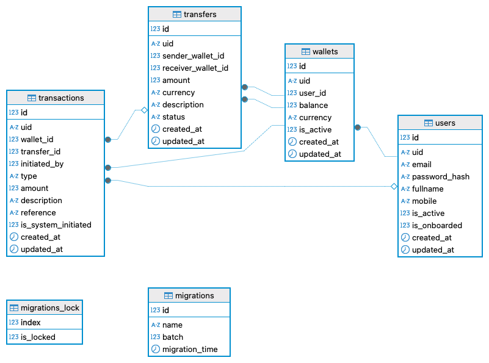

# Demo Credit

## Table of Contents
- [Demo Credit](#demo-credit)
  - [Table of Contents](#table-of-contents)
  - [Project Overview](#project-overview)
  - [Technologies Used](#technologies-used)
  - [Installation](#installation)
  - [Configuration](#configuration)
  - [Database Setup](#database-setup)
  - [API Endpoints](#api-endpoints)
    - [App](#app)
    - [Auth Management](#auth-management)
    - [Account Management](#account-management)
    - [Wallet Management](#wallet-management)
    - [Transaction Management](#transaction-management)
  - [E-R Diagram](#e-r-diagram)
  - [Usage](#usage)
  - [Testing](#testing)
  - [Assumptions](#assumptions)
  - [License](#license)

## Project Overview
Demo Credit is a mobile lending app that requires wallet functionality. This is needed as borrowers need a wallet to receive the loans they have been granted and also send the money for repayments. This project provides a backend api implementation wallet service where:

1. A user can create an account
2. A user can fund their account
3. A user can transfer funds to another user's account
4. A user with records in the Lendsql Adjutor [Karma blacklist](https://api.adjutor.io/) should never be onboarded

## Technologies Used
- *Node.js*: JavaScript runtime for building the server.
- *NestJS*: A progressive Node.js framework.
- *Knex.js*: SQL query builder for Javascript.
- *MySQL*: Relational database management system.
- *Typescript*: Javascript with syntax for types.


## Installation
1. Clone the repository:
   ```bash
   $ git clone https://github.com/ajesamson/demo-client.git
   $ cd demo-client
   ```
   

2. Install dependencies:
```bash
   npm install
```
   

## Configuration
Create a .env file in the root directory and add the following environment variables:

>DB_CLIENT=mysql2
DB_HOST=localhost
DB_PORT=3306
MYSQL_USER=your_db_user
MYSQL_PASSWORD=your_db_password
MYSQL_DATABASE=your_database
MYSQL_ROOT_PASSWORD=your_password
ADJUTOR_API_KEY=your_adjutor_api_key
JWT_SECRET=your_jwt_secret


## Database Setup
1. Create a MySQL database by running the docker-compose command:
   
   _Note: This require docker setup_
    ```bash
    # start the mysql service
    $ make start

    # stop the mysql service
    $ make stop
    ```
    As an alternative, update the environment variable to link up with external database service provider.

2. Run migrations to set up the database schema after the mysql service is full started:
    ```bash
    $  npx knex migrate:latest
    ```


## API Endpoints
_Note: An example schema has been provided for each endpoint in the swagger documentation._

### App
- *GET /api*: Check health status
### Auth Management
- *POST /api/auth/login*: Login with email and password for auth token.
- *GET /api/auth/profile*: View logged in user details.
  
### Account Management
- *POST /api/users/register*: Register a new user.
- *GET /api/users*: Retrieve all registered users.
- *GET /api/users/:id*: Get user details by ID.
- *PATCH /api/users/:id*: Update user's password and fullname.
- *GET /api/users/:id/wallet*: Get user's wallet. This caters for non-authorization implementation

### Wallet Management
- *POST /api/wallets*: Create a new wallet for a user without wallet.
- *GET /api/wallets*: Get all wallets.
- *GET /api/wallets/:id*: Get wallet details.
- *GET /api/wallets/:id/transactions*: Get all wallet transaction.

### Transaction Management
- *POST /api/transactions*: Create a new transaction for sender (debit/ credit / transfer).
  
  _Note: `receiver_wallet_id` field is only required for transfer  transaction and `type` value MUST be `debit` as sender is debited_
- *GET /api/transactions/*: Get all transactions.
- *GET /api/transactions/:id*: Get a transaction detail.
- *PATCH /api/transactions/:id*: Update transaction reference

## E-R Diagram
The entity relation diagram for the database is as shown below:



## Usage
1. Start the server:
```bash
  $ npm start
```

2. Use tools like Postman or cURL to interact with the API endpoints. A swagger documentation has been provided at the app url:
   ```
   http://localhost:3000/api#
   ```

## Testing
To run tests, use the following command:
```bash
$ npm test
```

## Assumptions  
1. It was assumed that all transactions are in Naira (NGN)
2. There is no currency conversion during transaction but that can be easily integrated.

   
## License
This project is licensed under the MIT License. See the [LICENSE](LICENSE) file for details.
